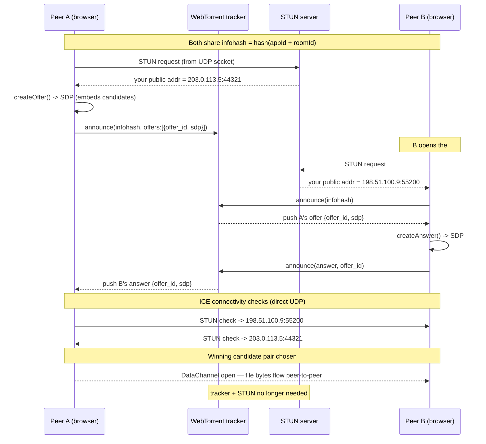

# airdrop.harsath.com

Peer-to-peer, bidirectional file transfer in the browser. No backend and no central storage — files travel directly between browsers over a WebRTC data channel. The site itself is fully static.

Built for moving files between a corporate VM (locked-down firewall) and a personal laptop, in both directions, with more than two participants supported.

## How it works

- **Signaling** — [Trystero](https://github.com/dmotz/trystero) exchanges the WebRTC handshake over public WebTorrent WebSocket trackers, so no signaling server is needed. The tracker list is set in `RELAY_URLS` in `app.js`; `tracker.webtorrent.dev` is the primary (reachable from the target corporate network). If trackers ever get blocked everywhere, Trystero can switch to a Firebase Realtime Database strategy instead (Google infra on `wss:443`) — a documented fallback.
- **Relay when direct fails** — a free [metered.ca](https://www.metered.ca/) TURN server relays the encrypted stream when a direct peer-to-peer path is blocked (e.g. strict corporate firewalls). On a permissive network (same LAN), the transfer goes direct and touches no server at all.
- **Hosting** — static files on GitHub Pages.

A room is identified by the URL hash (`#roomid`), which is generated on first visit. Share the full URL; anyone who opens it joins the same room.

### The handshake, in detail

Two browsers behind NAT can't address each other directly. Three roles solve this, and they are easy to confuse because they all happen at connection setup:

- **Signaling (the tracker)** — a public WebTorrent WebSocket tracker acts as a note-passer. Both peers announce the same infohash (derived from the app ID + room ID) and the tracker relays each peer's WebRTC session description to the other over a persistent WebSocket. It never reads or forwards the file bytes; it only brokers the introduction.
- **STUN** — a separate server that tells a peer its own public IP and port as seen from the outside (the address its NAT maps its local UDP socket to). This becomes a reachable candidate that the other peer can target.
- **TURN** — a relay used only when a direct path can't be established (e.g. symmetric NAT on a corporate network). Both peers send to the TURN server's fixed address and it forwards between them.

The **ICE agent** built into each browser orchestrates all of this: it gathers candidate addresses (local, STUN-discovered public, and TURN relay), exchanges them inside the SDP via the tracker, tests every candidate pair, and keeps the first one that works. Once the data channel is open, the tracker and STUN are no longer involved; TURN stays in the path only if it was the winning route.



### Topology and its cost

Connections are a full mesh: with N participants, each peer holds a separate encrypted connection to every other peer. Sending one file therefore uploads N−1 copies from the sender — fine up to roughly 6–8 peers, then the sender's uplink becomes the bottleneck. For the intended two-machine use case this is a single copy.

## Files

| File | Purpose |
|------|---------|
| `index.html` | UI and styles |
| `app.js` | Trystero room, TURN fetch, send/receive logic |
| `CNAME` | Custom domain for GitHub Pages |

## Fallback: Firebase signaling

Not needed for the default setup (torrent trackers). Only use this if trackers get blocked on every network you care about. It swaps signaling to a free Firebase Realtime Database (Google infra on `wss:443`, which corporate firewalls allow but which won't rate-ban you like public Nostr relays do).

To switch: set `TRYSTERO_URL` to `https://cdn.jsdelivr.net/npm/trystero@0.21.6/firebase/+esm`, replace the `relayUrls` option with `appId: FIREBASE_DB_URL`, then do this one-time Firebase setup:

1. Open the [Firebase console](https://console.firebase.google.com/) and create a project (Analytics can be skipped).
2. **Build → Realtime Database → Create Database.** Pick a location and start in **test mode**.
3. Copy the database URL shown at the top of that page, e.g. `https://your-project-default-rtdb.firebaseio.com` (region variants look like `https://your-project-default-rtdb.europe-west1.firebasedatabase.app`).
4. In the **Rules** tab, scope access to Trystero's path and publish:

   ```json
   {
     "rules": {
       "__trystero__": {
         ".read": true,
         ".write": true
       }
     }
   }
   ```

5. Paste the database URL into `FIREBASE_DB_URL` at the top of `app.js`.

Only the database URL is needed (no API key). Access is governed by the rules above, not by a secret, so the URL is safe to ship in the client.

## Run locally

Serve the folder over HTTP (a module script and clipboard access need a real origin, not `file://`):

```
python3 -m http.server 8000
```

Open `http://localhost:8000` in two browser tabs (or two devices) to test a transfer.

## Deploy

Push to the repository's default branch, then enable GitHub Pages for that branch in the repository settings. Point the `airdrop.harsath.com` DNS record at GitHub Pages and keep the `CNAME` file in place.

## Known limits (v1)

- Received files are buffered fully in memory, so very large files (multi-GB) may fail on low-memory devices. Streaming to disk is a planned upgrade.
- The TURN API key is exposed in the client. This is metered.ca's intended model (the key is rate-limited), but rotate it if abuse occurs.
- Closing a tab mid-transfer cancels it; there is no resume.
